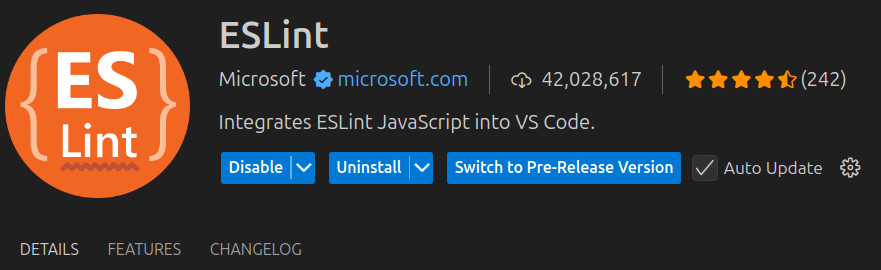
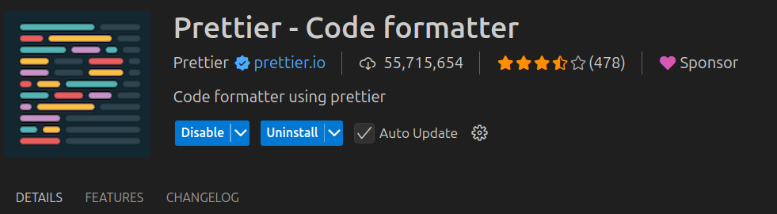
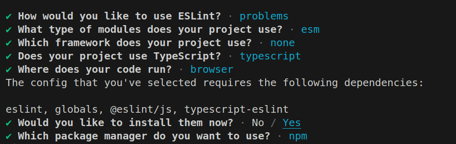

# OnBoarding-TypeScript

Este repositorio te guiará en la configuración de tu entorno para comenzar a trabajar con **TypeScript** y resolver tus primeros ejercicios.

## Opción 1: Instalación de TypeScript en el ordenador (Recomendada para ejercicios sueltos)

La forma más sencilla para empezar a trabajar con TypeScript es instalarlo globalmente en tu ordenador. Esto te permitirá compilar tus archivos `.ts` a `.js` y ejecutar tus programas directamente.

### Pasos:

1. **Descargar e instalar TypeScript:**

   - Ve a la página oficial de TypeScript: [https://www.typescriptlang.org/download/](https://www.typescriptlang.org/download/).

2. **Instalar TypeScript globalmente con npm:**

   - Abre la terminal y ejecuta el siguiente comando:

   ```bash
    npm install -g typescript
   ```

3. **Verificar la instalación:**

   - Para comprobar que TypeScript se ha instalado correctamente, ejecuta:

     ```bash
     tsc --version
     ```

   - Esto debería devolver la versión de TypeScript instalada en tu máquina.

4. **Estructura de carpetas recomendada a crear**

```bash
typescript-onboarding/
│── solutions/
│   ├── exercise1/
│   │   ├── index.ts
│   │   ├── index.html
│   ├── exercise2/
│   │   ├── index.ts
│   │   ├── index.html
│   ├── exercise3/
│   │   ├── index.ts
│   │   ├── index.html
```

- Ahora creareamos el archivo **package.json** que contendrá la configuración básica de nuestro proyecto con el comando:

```bash
npm init -y
```

5. **Configurar TypeScript**

- Genera un archivo de configuración para TypeScript con el siguiente comando:

```bash
tsc --init
```

- Luego, edita el archivo **tsconfig.json** para que luzca así:

```bash
{
  "compilerOptions": {
    "target": "ES6",
    "module": "ES6",
    "rootDir": "./solutions",
    "outDir": "./dist",
    "strict": true
  }
}
```

6. **Compilar los archivos TypeScript**

- Para compilar todos los ejercicios:

```bash
tsc
```

- Si prefieres que TypeScript observe los archivos y los compile automáticamente cada vez que realices un cambio, puedes usar el modo **watch**:

```bash
tsc --watch
```

- Si usas **tsc --watch** desde el principio, no necesitarás compilar manualmente después. Cada vez que guardes un archivo o añadas un nuevo archivo .ts en la carpeta **solutions/**, el compilador se encargará de compilarlo automáticamente en la carpeta **dist/**.

- Una vez hayamos compilado se generará la carpeta **dist/** con los archivos compilados, manteniendo la misma estructura de **solutions/**.

7. **Configurar Prettier y ESLint (Opcional, pero recomendado)**
  - Para mejorar la calidad del código, puedes instalar las extensiones de Prettier y ESLint:

  - ESLint
  

  - Prettier
  

- Una vez tenemos las extensiones instaladas vamos a ejecutar el siguiente comando para crear un archivo de configurar eslint con el siguiente comando:

```bash
npm init @eslint/config@latest
```
- Este comando nos hará unas preguntas para que seleccionemos la configuración que queremos y una vez respondamos nos generará un archivo **eslint-config.mjs** con nuestra configuración.

- Nos quedará un resultado a las preguntas tal que así:


Una vez generado el archivo ya nos resaltará los posibles warnings y/o errores.

- A continuación creamos el archivo **.prettierrc** con el siguiente contenido (sin los comentarios):

```bash
{
  "semi": true, # Fuerza el uso de punto y coma al final de las líneas.
  "singleQuote": false, # Usa comillas simples en lugar de dobles en strings.
  "trailingComma": "all" # Agrega comas al final de listas y objetos para mejorar el control de versiones.
}
```

- Para aplicar esta configuración a nuestros archivos una vez tengamos el archivo creado y la extensión instalada podemos usar el atajo **alt+shift+f** en Windows o **Ctrl+shift+i** en Linux indicandole al VSC cuando lo hagamos que queremos que use el formateador de Prettier.

**_Nota: Las configuraciones de los archivos prettier y eslint pueden variarse y personalizarse a nuestro gusto_**

## Opción 2: Crear un proyecto con Vite (Ideal para proyectos más grandes)

Si prefieres trabajar en un entorno de desarrollo más estructurado, puedes usar [Vite](https://vitejs.dev/), una herramienta moderna para crear proyectos de desarrollo rápido con soporte nativo para TypeScript.

### Pasos:

1. **Crear un nuevo proyecto con Vite:**

   - Ejecuta el siguiente comando para crear un nuevo proyecto usando la plantilla de TypeScript:

     ```bash
     npm create vite@latest
     ```

   - **1.1** Selecciona el nombre del proyecto
   - **1.2** Selecciona el framework vanilla
   - **1.3** Selecciona Typescript

   - Esto creará una nueva carpeta con un proyecto de Vite configurado para TypeScript.

2. **Instalar dependencias del proyecto:**

   - Accede a la carpeta del proyecto recién creado:

     ```bash
     cd nombre-proyecto
     ```

   - Luego, instala las dependencias:

     ```bash
     npm install
     ```

3. **Iniciar el servidor de desarrollo:**

   - Para comenzar a trabajar en tu proyecto, ejecuta:

     ```bash
     npm run dev
     ```

   - Esto iniciará el servidor de desarrollo y abrirá el proyecto en tu navegador.

4. **Desarrollo con Vite:**
   - Puedes comenzar a agregar y modificar archivos `.ts` en el proyecto. Los cambios se reflejarán automáticamente en el navegador gracias a la recarga en vivo de Vite.
   - Esta opción es ideal si deseas un entorno de desarrollo más optimizado, con recarga en vivo y mejor integración con herramientas modernas.
